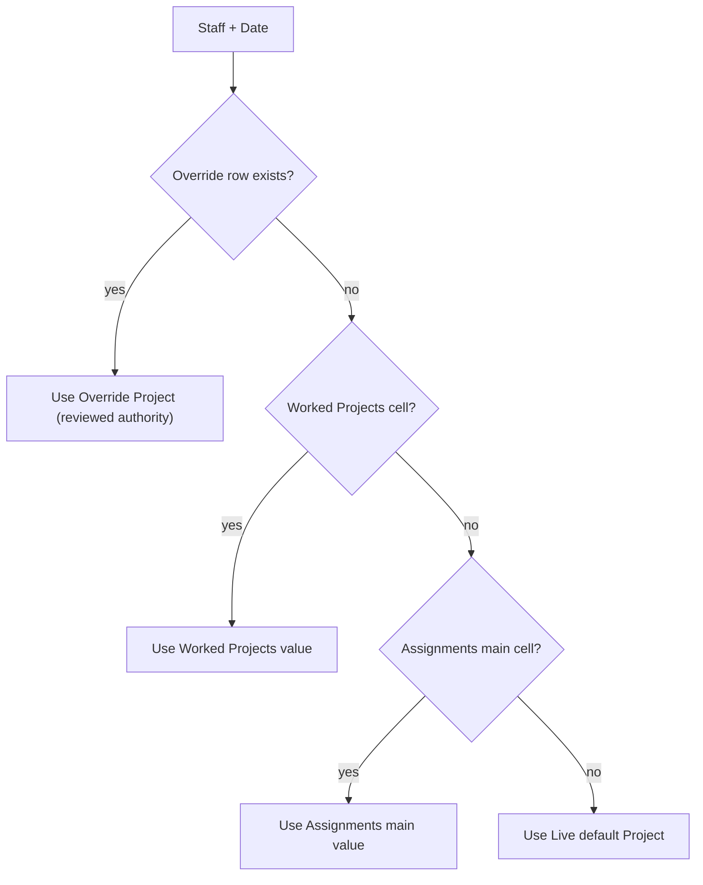

# Active Roster Log — Mechanics and Schema

The Active Roster Log is the operational source of truth for attendance and
per-day project classification. It is a large, human-maintained workbook; this
document captures its schema and resolution mechanics thoroughly enough that the
repo could, in a worst case, regenerate or rebuild it. It also explains the
multi-project mechanic that the admin summaries depend on.

## Tab families (per month)

For each month the workbook carries a family of tabs, named `{Kind} - {Month YYYY}`:

| Tab | Role |
| --- | --- |
| `Live - {Month}` | Raw attendance. Row 1 title, row 2 headers: `Staff Name | Project | <Mon DD - Clock In> | <Mon DD - Clock Out> | ...`. Clock cells hold times (`9:00 AM`) and may carry trailing notes (`9:28:00 AM/ Bonita`) or non-work markers (`PTO`). |
| `Worked Projects - {Month}` | Per-day worked-project classification. Row 2: `Staff Name | Default Project | <date columns>`. Each cell is the project actually worked that day (blank = use default). |
| `Assignments - {Month}` | Per-day project assignment. A main auto-fill table (`Staff Name | Default Project | <date columns>`) PLUS an **Overrides** sub-table lower down. |
| `Automated - {Month}` | Machine-maintained scratch/derivation (not an input to billing). |

Supporting tabs: `Projects` (the project catalog / list), `Roster`, `Summary`,
`CF Rules`, `Formulas`, `Expected Hours - {Month}`, `Billing Exceptions`,
`Unassigned Hours - {Month}`, `Admin Summary Export`, and per-month
`Bonitas Tracker - {Mon YY}` (the daily Bonita-format tracker).

## The Assignments override table

The `Assignments - {Month}` tab is the heart of the multi-project mechanic.

1. Main auto-fill table (rows under the `Staff Name` header): per-staff,
   per-date cells naming the project worked that day; blank cells fall back to
   the `Default Project`.
2. Overrides sub-table (announced by a row containing `Overrides (only if
   different from Default Project)`, header `Override Staff Name | Override Date
   | Override Project | Notes`): explicit, reviewed corrections. These are the
   highest authority (e.g. `Richard review: Neurons confirmed`).

This precedence is implemented in
[triage/admin_billing_summary/reader.py](triage/admin_billing_summary/reader.py)
(`read_month`) and is consistent with the resolution hierarchy in
[docs/ROSTER_BILLING_PIPELINE_INSIGHTS.md](docs/ROSTER_BILLING_PIPELINE_INSIGHTS.md):
approved override > resolved worked-project > assignment/default > raw note.

## Multi-project reality (Cyen Heyliger)

A single tech routinely works several projects in one month. Cyen Heyliger is
the canonical example in the live data:

- Default project: `Neuron Deployments`.
- Worked across `Neuron Deployments`, `iPhone Support`, and `Projects Team`
  on different May days (per the Assignments main table).
- Reviewed Overrides (`Richard review: Neurons confirmed`) pin several early-May
  days back to `Neuron Deployments`.

Any engine that assumes one project per tech (or hardcodes a project / assignment
type) is wrong. Assignment/project MUST be resolved per day.

The proven low-level reader [triage/roster_parser.py](triage/roster_parser.py)
(`parse_roster`, `_load_assignments`, `_find_assignments_sheet`) already models
the main table + Overrides sub-table and is regression-tested against the live
roster (Cyen Apr 2 = `Bonita` from the main table; Apr 6 = `Projects Team` from
the Overrides table).

## Hours math

- Gross span = clock-out − clock-in (with +24h for overnight shifts).
- Lunch / unpaid deduction (`_lunch_deduction`): gross ≥ 8h → 1.0; ≥ 6h → 0.5;
  else 0.
- Net hours = max(0, gross − lunch).
- Punch cells tolerate trailing notes; the time is parsed and the note retained
  as evidence (never billed).

## Project catalog and billing buckets

The `Projects` tab lists valid projects (`Neuron Deployments`, `Projects Team`,
`iPhone Support`, `DSE`, `Delivery / Transport / Disposal`, `TOW`, `ReConnect`,
etc.). For rollups, projects map to billing buckets in
[triage/admin_billing_summary/models.py](triage/admin_billing_summary/models.py)
(`billing_bucket`): Neurons, Delivery / Transport / Disposal, Projects Team,
iPhones, Other. `Neuron Deployments` is presented client-facing as
`Northwell - Neurons`.

## Reporting cadence

Friday is the reporting batch marker: Monday–Friday work maps to that Friday's
batch; weekend work generally rolls into the next Friday batch unless explicitly
handled (e.g. go-live weekends).

## Non-work markers and exclusions

`Live` punch cells may contain `PTO`, `NON-PTO`, `N/A`, `out sick`, `vacation`,
`off ...`. These are non-work markers (no billable time). Off-project coverage
punches (e.g. `/ Bonita`) are parsed for time but excluded from project totals,
recorded as review evidence.

## Worst-case regeneration

To rebuild the log from minimal inputs you need, per month: the `Live`
attendance grid (staff × date clock pairs), the `Worked Projects` grid, and the
`Assignments` main + Overrides tables. Everything downstream (Expected Hours,
Billing Summary, Admin Summary Export, Bonita trackers) is derivable from those
three grids plus the `Projects` catalog and the math above.
