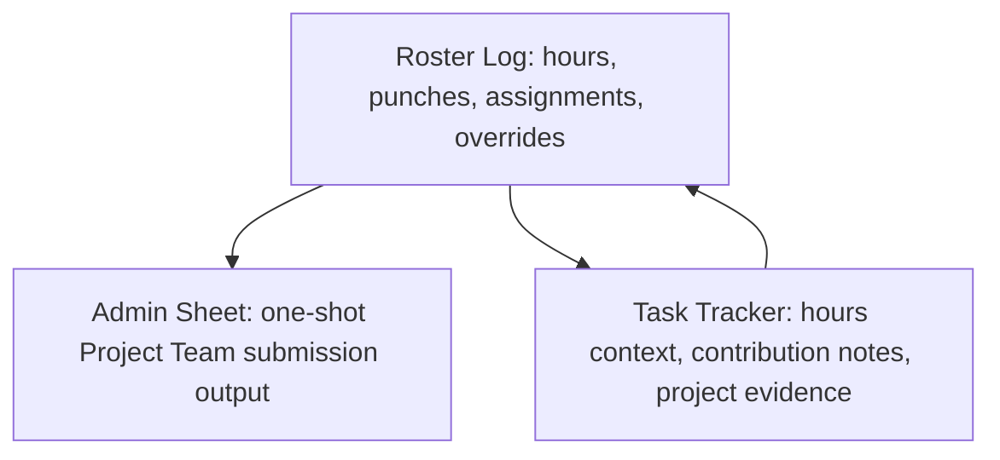
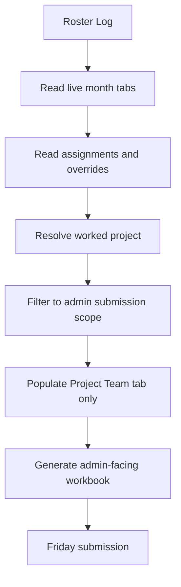
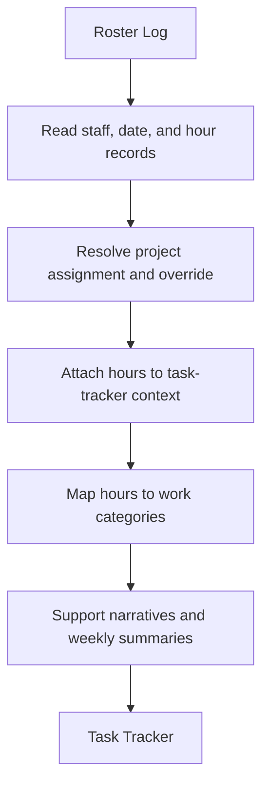
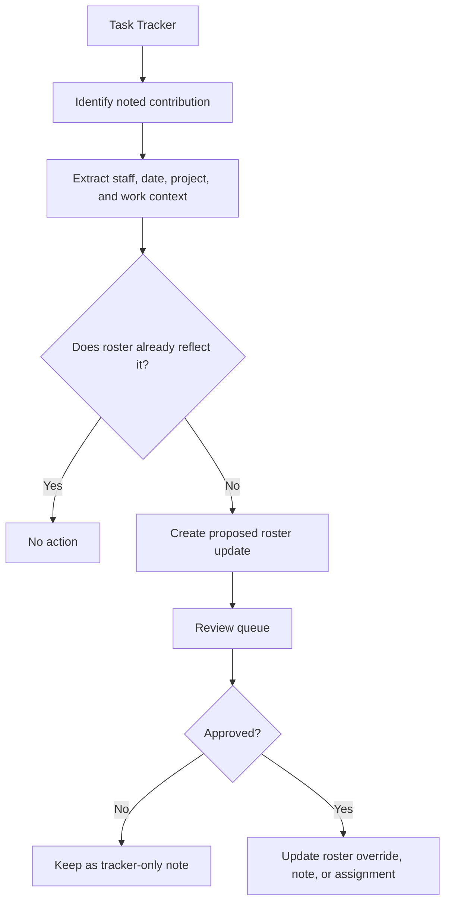
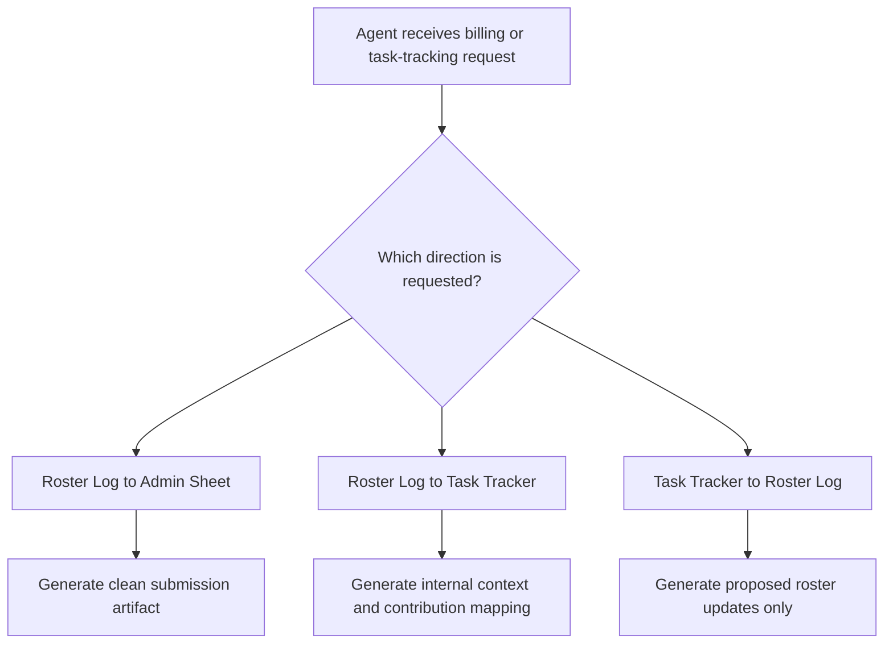

# Billing Pipeline Directional Contract

This document defines the supported billing and task-tracking workflow directions for Web Excel repair and triage work.

The central rule: direction matters. A clean admin submission export is not the same thing as internal task contextualization, and neither is the same thing as a reviewed roster backfill.

## Direction Map



## Priority Order

1. Roster Log to Admin Sheet
2. Roster Log to Task Tracker
3. Task Tracker to Roster Log

Agents must identify the requested direction before generating scripts, workbook patches, summaries, or corrections.

---

## 1. Roster Log to Admin Sheet

High-priority submission workflow.



### Purpose

Create a clean admin-facing workbook for Friday billing or submission review.

### Rules

| Rule | Requirement |
|---|---|
| Output scope | Admin-facing only |
| Default workbook scope | Project Team tab only unless explicitly requested |
| Project classification | Use resolved worked-project logic, including assignments and overrides |
| Internal notes | Do not expose |
| Confidence fields | Do not expose |
| Exception machinery | Keep internal unless it blocks submission |
| Priority | High |

### Contract

Roster Log to Admin Sheet is a one-shot submission export. It should produce a clean admin-facing Project Team workbook from resolved roster data. It should not expose internal logic, review scaffolding, confidence notes, private notes, or task-tracker context.

---

## 2. Roster Log to Task Tracker

Medium-priority contextualization workflow.



### Purpose

Explain what the hours supported.

The admin sheet says who worked, when, and how much. The task tracker adds what the labor supported: configuration, deployment, logistics, project coordination, exceptions, and documented contributions.

### Rules

| Rule | Requirement |
|---|---|
| Output scope | Internal context |
| Goal | Explain hours through task and project activity |
| Acceptable context | Project notes, contribution notes, deployment context, configuration work, logistics, exceptions |
| Admin-ready by default | No |
| Priority | Medium |

### Contract

Roster Log to Task Tracker is for contextualizing hours. It should help explain what work the hours supported, including project activity, configuration, deployment, logistics, exceptions, and contribution narratives. It is not the admin submission artifact.

---

## 3. Task Tracker to Roster Log

Low-priority reviewed backfill workflow.



### Purpose

Propose roster updates based on noted contributions.

This is a backfill workflow, not the normal direction. The task tracker can suggest that the roster needs an update, but it must not silently rewrite the roster.

### Rules

| Rule | Requirement |
|---|---|
| Output scope | Proposed roster corrections |
| Automation level | Review-gated |
| Direct write allowed | No, unless explicitly approved |
| Typical updates | Override, project note, assignment clarification |
| Priority | Low |

### Contract

Task Tracker to Roster Log is a low-priority backfill path. It should only propose roster updates based on noted contributions. It must not silently mutate the roster log. All updates should pass through a review queue before becoming roster data.

---

## Agent Decision Rule



## Recommended Script Names

```text
roster_to_admin_submission.py
roster_to_task_context.py
task_tracker_to_roster_backfill.py
```

## Friday Reporting Rule

Friday is the reporting batch marker. Work performed Monday through Friday maps to that Friday's reporting or submission batch. Weekend work generally rolls into the next Friday reporting batch unless explicitly handled otherwise.

## Implementation Notes

- Overrides beat default assignment.
- Resolved worked-project logic beats raw assumption.
- Raw notes that conflict with resolved logic should create exceptions.
- Admin-facing output should remain clean and narrow.
- Internal task-tracker context can be richer, but it must not leak into admin submission artifacts.
- Backfill from Task Tracker into Roster Log must be proposed, reviewed, and approved before mutation.
