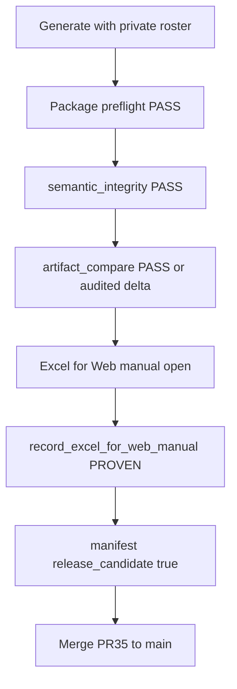

# PR #35 checkpoint and private proof guide

**Do not merge [PR #35](https://github.com/EndeavorEverlasting/web-excel-repair-triage/pull/35) until private proof passes.**

Branch: `feat/neuron-track-hours-bonita-generator-2026-06-02`  
Head: [`91b7ca3`](https://github.com/EndeavorEverlasting/web-excel-repair-triage/commit/91b7ca368d265e850863aa7553d46806833d5018)

| Item | State |
|------|--------|
| PR #35 open, mergeable | Yes |
| PR #36 / #37 closed, unmerged | Yes — do not reopen |
| CI **Artifact engine tests** on `91b7ca3` | Success |
| Fixture-only proof (`Outputs/proof_pr35_*`) | `release_candidate: false` until refs + manual PROVEN |
| Private proof (real roster + approved refs) | **Operator gate** |

**After proof passes:** squash-merge **#35 only**.

---

## What `91b7ca3` implements

| Capability | Location |
|------------|----------|
| Release gate | [`triage/release_status.py`](../triage/release_status.py) |
| Manual Excel for Web proof | [`triage/record_excel_for_web_manual.py`](../triage/record_excel_for_web_manual.py) |
| Approved delta audit | [`triage/artifact_compare.py`](../triage/artifact_compare.py) |
| Nonblank column failures | [`triage/artifact_profiles.py`](../triage/artifact_profiles.py) |
| Dual admin references | [`triage/admin_billing_summary/cli.py`](../triage/admin_billing_summary/cli.py) |
| Portal KPIs | [`triage/sidecar_html/adapters.py`](../triage/sidecar_html/adapters.py) |



---

## Prerequisites

### Branch and environment

```powershell
cd "C:\Users\Cheex\Desktop\dev\Web Excel Triage"
git fetch origin
git switch feat/neuron-track-hours-bonita-generator-2026-06-02
git pull --ff-only origin feat/neuron-track-hours-bonita-generator-2026-06-02

# Windows: use repo venv (system python may lack openpyxl)
.\.venv\Scripts\Activate.ps1
```

### Active roster log (latest)

```powershell
$Roster = "Candidates\attendance artifacts 6-2-2026\INTERNAL_May_Billing_Active_Roster_Log_2026-06-02-update so that partial hours are flagged beyond CF.xlsx"
Test-Path $Roster   # must be True
```

Full path:

```text
C:\Users\Cheex\Desktop\dev\Web Excel Triage\Candidates\attendance artifacts 6-2-2026\INTERNAL_May_Billing_Active_Roster_Log_2026-06-02-update so that partial hours are flagged beyond CF.xlsx
```

### Approved references (local, gitignored)

Place blessed workbooks under [`References/approved/`](../References/approved/) — never commit `.xlsx` there.

| Role | Placeholder filename |
|------|----------------------|
| Bonita | `Bonita_Neuron_Track_Hours_APPROVED.xlsx` |
| Client (April/May) | Your blessed Client reference(s) |
| Internal (optional) | Blessed Internal reference(s) if Internal is a formal artifact |

Without references, `artifact_compare_status` stays `NOT_RUN` and delivery `release_candidate` stays **false**.

---

## Private proof run

### Step A — Generate

```powershell
$Roster = "Candidates\attendance artifacts 6-2-2026\INTERNAL_May_Billing_Active_Roster_Log_2026-06-02-update so that partial hours are flagged beyond CF.xlsx"

python -m triage.nw_prj_neuron_track_hours.bonita_cli `
  --roster-log $Roster `
  --months 2026-04 2026-05 `
  --out-dir Outputs/proof_pr35_bonita `
  --reference "References/approved/<APPROVED_BONITA>.xlsx" `
  --artifact-profile bonita_neuron_track_hours `
  --websafe

python -m triage.admin_billing_summary.cli `
  --roster-log $Roster `
  --months 2026-04 2026-05 `
  --out-dir Outputs/proof_pr35_admin_billing `
  --reference-client "References/approved/<APPROVED_CLIENT>.xlsx" `
  --reference-internal "References/approved/<APPROVED_INTERNAL>.xlsx" `
  --websafe
```

**Inspect under `Outputs/proof_pr35_*`:**

| Engine | Key artifacts |
|--------|----------------|
| Bonita | `Bonita_Neuron_Track_Hours_April_May_2026.xlsx`, `Neuron_Track_Hours_April_May_2026_manifest.json`, `Neuron_Track_Hours_April_May_2026_preflight.json`, `Bonita_Neuron_Track_Hours_artifact_compare.json`, `index.html` |
| Admin billing | `April_2026_Billing_Summary_Client.xlsx`, `May_2026_Billing_Summary_Client.xlsx`, Internal variants, `*_preflight.json`, `*_artifact_compare.json`, `admin_billing_summary_manifest.json`, `index.html` |

Rebuild portals after manual proof (optional):

```powershell
python -m triage.sidecar_html Outputs\proof_pr35_bonita
python -m triage.sidecar_html Outputs\proof_pr35_admin_billing
```

### Step B — Automated gates (JSON)

| Field | Delivery requirement |
|-------|----------------------|
| `preflight_pass` | `true` |
| `semantic_integrity` | `PASS` |
| `artifact_compare_status` | `PASS` (or audited delta) |
| `excel_for_web_manual_check` | `PROVEN` (after Step C) |
| `release_candidate` | `true` |

**Stop-ship:** repair prompt in Excel for Web; `Column1..ColumnN` corpse headers; forbidden submission strings; `required_nonblank_column_empty:*`; semantic compare FAIL without approved delta.

### Step C — Manual Excel for Web

Open each **delivery** workbook in Excel for Web (no repair banner). Then record:

```powershell
python -m triage.record_excel_for_web_manual `
  --out-dir Outputs/proof_pr35_bonita `
  --workbook "Outputs/proof_pr35_bonita/Bonita_Neuron_Track_Hours_April_May_2026.xlsx" `
  --status PROVEN `
  --checked-by "Richard" `
  --preflight-json "Outputs/proof_pr35_bonita/Neuron_Track_Hours_April_May_2026_preflight.json"

python -m triage.record_excel_for_web_manual `
  --out-dir Outputs/proof_pr35_admin_billing `
  --workbook "Outputs/proof_pr35_admin_billing/April_2026_Billing_Summary_Client.xlsx" `
  --status PROVEN `
  --checked-by "Richard" `
  --preflight-json "Outputs/proof_pr35_admin_billing/April_2026_Billing_Summary_Client_preflight.json"

python -m triage.record_excel_for_web_manual `
  --out-dir Outputs/proof_pr35_admin_billing `
  --workbook "Outputs/proof_pr35_admin_billing/May_2026_Billing_Summary_Client.xlsx" `
  --status PROVEN `
  --checked-by "Richard" `
  --preflight-json "Outputs/proof_pr35_admin_billing/May_2026_Billing_Summary_Client_preflight.json"
```

If repair prompt appears: `--status FAILED --repair-prompt-seen` — never `PROVEN`.

**Internal variants:** QA-only unless formally shared; Client delivery drives top-level `release_candidate`.

### Step D — Proof table (fill after run)

Latest private roster run (no approved refs yet) — see `Outputs/proof_pr35_*/private_proof_run_status.md`:

| Workbook | preflight | semantic | compare | excel_for_web | release_candidate |
|----------|-----------|----------|---------|---------------|-------------------|
| `Bonita_Neuron_Track_Hours_April_May_2026.xlsx` | PASS | PASS | NOT_RUN | NOT_PROVEN | false |
| `April_2026_Billing_Summary_Client.xlsx` | PASS | PASS | NOT_RUN | NOT_PROVEN | false |
| `May_2026_Billing_Summary_Client.xlsx` | PASS | PASS | NOT_RUN | NOT_PROVEN | false |

After refs + PROVEN, all delivery rows must show compare PASS and `release_candidate: true`.

---

## Merge decision matrix

| Condition | Action |
|-----------|--------|
| All delivery: preflight + semantic + compare PASS + PROVEN | Merge PR #35 |
| Repair prompt on delivery | Hold — fix generator, re-run |
| Compare FAIL without audited delta | Hold |
| Compare NOT_RUN on delivery | Hold — add `References/approved` |
| Fixture-only proof only | Hold (typical until refs + browser) |

Update PR #35 body with proof table, roster path, checker, date.

---

## Regression (pre-merge)

```powershell
python -m pytest `
  tests/test_cybernet_targets.py `
  tests/test_nw_prj_neuron_track_hours.py `
  tests/test_nw_prj_neuron_track_hours_bonita.py `
  tests/test_admin_billing_summary.py `
  tests/test_one_marcus_recon.py `
  tests/test_sidecar_html_portal.py `
  tests/test_artifact_compare.py `
  -q
```

Full-suite legacy failures: [`KNOWN_LEGACY_TEST_FAILURES.md`](KNOWN_LEGACY_TEST_FAILURES.md) — not a merge gate.

---

## Known gaps and risks

| Gap | Notes |
|-----|--------|
| Fixture proof ≠ private roster | New roster CF/partial-hour flags may change review rows or totals |
| Semantic hash sensitivity | `Generated` timestamps change hash — use audited delta if intentional |
| No approved xlsx in git | Operator must supply `References/approved/*.xlsx` locally |
| `internal_admin_log` profile | Reserved — Internal = admin `variant=internal` |
| Approved delta discipline | Code enforces audit fields; humans must write honest `reason` |

---

## PR #34 disposition (do not merge with #35)

Billing summary path in PR #34 is **superseded by PR #35**. May roster CF/preflight (`triage.may_roster_webexcel`) is **not disposed** until reviewed post-merge. Leave PR #34 open until that review completes.
